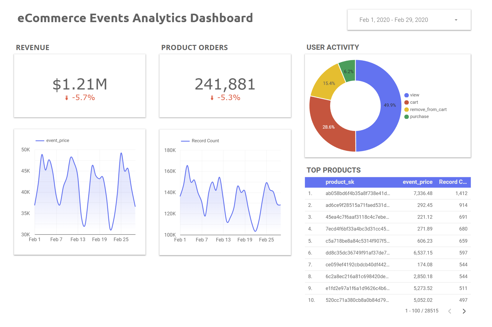

# eCommerce Events Data Pipeline and Analysis
An online flower shop, has been experiencing growth in website traffic and customer orders. The business wants to better understand user behavior, optimize marketing efforts, and improve sales performance. However, their raw ecommerce event data—such as product views, cart additions, and completed purchases is collected by CDP (Customer Data Platform).

To support data-driven decision-making, their company needs a data pipeline that ingests, processes, and transforms this raw event data into clean, structured tables and dashboards. These insights should help answer key questions like:

- What are the most popular flower products?
- How do users behave before making a purchase?
- What time of day or day of the week has the highest sales volume?
- Which users are most engaged or likely to return?

Kaggle Dataset can be found [here](https://www.kaggle.com/datasets/mkechinov/ecommerce-events-history-in-cosmetics-shop).

## Technologies
- IaC: Terraform
- Workflow Orchestration: Python/Airflow
- Data Lake: Google Cloud Storage (GCS)
- Data Warehouse: Google BigQuery + dbt
- Data Visualization: Looker Studio

## Data Pipeline


## Reproducibility
### Requirements
A virtual machine is recommended with the following:
- Python 3.9+
- Terraform
- Astro CLI (for Airflow)
- Docker CLI/Desktop 
- Google Service Account

> [!IMPORTANT]  
> In your Google Cloud Project, create a **Google Service Account** with the following roles:
> - BigQuery Admin
> - Storage Admin
> - Viewer
>
> Download the account credentials and place it on your system (e.g. `/home/<your-username>/.keys/project_creds.json`)
> Then use that as a system environment variable using: 
> ```
> export GOOGLE_APPLICATION_CREDENTIALS="/home/<your-username>/.keys/project_creds.json"
> ```

In the project root directory, run `setup.sh` to automatically install Docker, Terraform, and Astro CLI in your system.
```
sudo ./setup.sh
```

### Setup Guidelines

1. After configuring your service account and terraform, navigate to `terraform/` directory and **modify** `variables.tf` config according to your project details

2. Then apply your settings to create the necessary dataset and gcs bucket:

For first time setting up, initizalize terraform.
```
terraform init
```

```
terraform apply
```

3. Modify `docker-compose.override.yml` and `Dockerfile` to properly mount your service account credentials to airflow container.

4. Navigate to `airflow/` and put `kaggle.json` in `include/` directory.

Start the orchestration using astronomer:
```
astro dev start
```

## Analytics Dashboard


You can view the live dashboard [here](https://lookerstudio.google.com/reporting/18ae7e54-43ec-426b-b21c-a5eaf34f6657)

## Future Improvements
- makefile
- more complete/detailed schema
- better metrics for dashboard