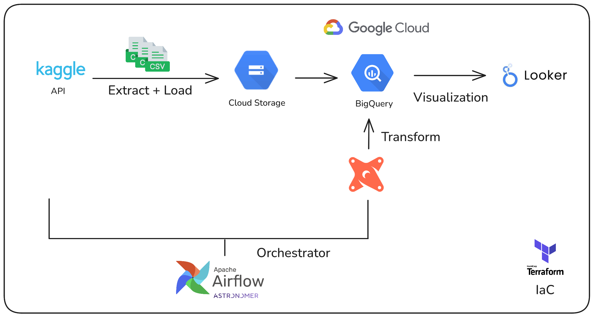

# eCommerce Events Data Pipeline and Analysis
An online cosmetic store, has been experiencing growth in website traffic and customer orders. The business wants to better understand user behavior, optimize marketing efforts, and improve sales performance. Their raw ecommerce event data such as product views, cart additions, and completed purchases are collected using SaaS.

To support data-driven decision-making, their company needs a data pipeline that ingests, processes, and transforms this raw event data into clean, structured tables and dashboards. These insights should help answer key questions like:

- What are the most popular flower products?
- How do users behave before making a purchase?
- What time of day or day of the week has the highest sales volume?

Kaggle Dataset can be found [here](https://www.kaggle.com/datasets/mkechinov/ecommerce-events-history-in-cosmetics-shop).

## Technology Stack
- IaC: Terraform
- Workflow Orchestration: Python/Airflow
- Data Lake: Google Cloud Storage (GCS)
- Data Warehouse: BigQuery + dbt
- Data Visualization: Looker Studio

## Data Pipeline


## Reproducibility
### Requirements
A virtual machine is recommended with the following:
- Python 3.x
- Terraform
- Astro CLI (for Airflow v2.x)
- Docker CLI/Desktop 
- Google Service Account

In the project root directory, run `setup.sh` to automatically install Docker, Terraform, and Astro CLI in your system.
```
sudo ./setup.sh
```

> [!IMPORTANT]  
> In your Google Cloud Project, create a **Google Service Account** with the following roles:
> - BigQuery Admin
> - Storage Admin
> - Viewer
>
> Download your account credentials and place it on your system (e.g. `/home/<your-username>/.keys/project_creds.json`)
> Then assign that as a system environment variable using: 
> ```
> export GOOGLE_APPLICATION_CREDENTIALS="/home/<your-username>/.keys/project_creds.json"
> ```

### Setup Guidelines

1. After configuring your service account and terraform, navigate to `./terraform` and modify `variables.tf` config according to your project details

2. Then apply your settings to create the necessary bigquery dataset and gcs bucket:

For first time setting up, initialize terraform:
```
terraform init
```
Then apply:

```
terraform apply
```

3. In `./airflow`, modify `docker-compose.override.yml` and `Dockerfile` to properly mount your service account credentials to airflow container.

4. Since this project utilizes Kaggle's API, [create a new kaggle api token](https://www.kaggle.com/discussions/getting-started/524433) for your credentials `kaggle.json`, and place it into `./airflow/include/`.

Start the orchestration using astronomer:
```
sudo astro dev start
```

5. Check pipeline status on airflow ui at `localhost:8080` (username and password is **admin**)

## Analytics Dashboard


You can view the live dashboard [here](https://lookerstudio.google.com/reporting/18ae7e54-43ec-426b-b21c-a5eaf34f6657)

## Future Improvements
- makefile
- more detailed schema
- better metrics for dashboard
